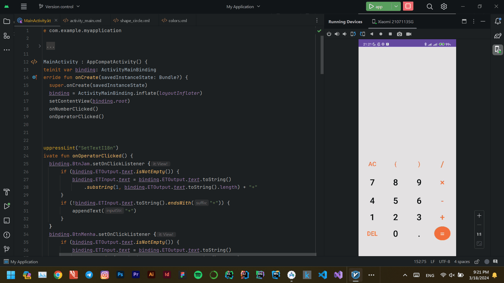

# Simple Calculator

This is a simple calculator application developed using Kotlin language with XML for layout and exp4j library for mathematical expressions evaluation.




## Features

- Basic arithmetic operations: addition, subtraction, multiplication, and division.
- Support for parentheses in expressions.
- Error handling for invalid expressions.

## Installation

1. Clone the repository:

```bash
git clone https://github.com/your-username/simple-calculator.git
 ```

2. Open the project in Android Studio.
3. Build and run the application on an Android emulator or a physical device.

## Usage


1. Launch the application on your device.
2. Enter a mathematical expression using the provided keypad.
3. Press the "=" button to calculate the result.
4. The result will be displayed on the screen.

## Dependencies

**[exp4j](https://github.com/fasseg/exp4j)**: A Java library for evaluating mathematical expressions.

## Contributing
Contributions are welcome! If you'd like to contribute to this project, feel free to open an issue or submit a pull request.

